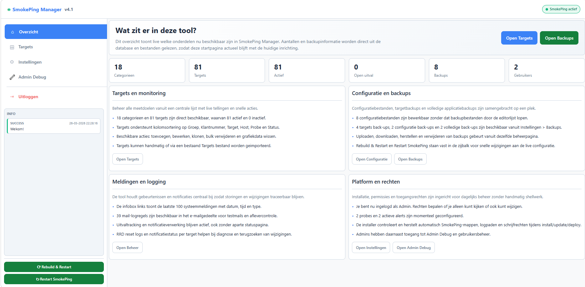
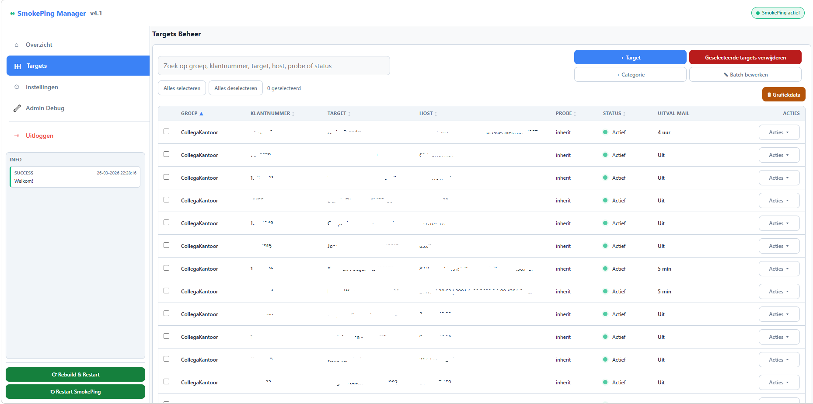
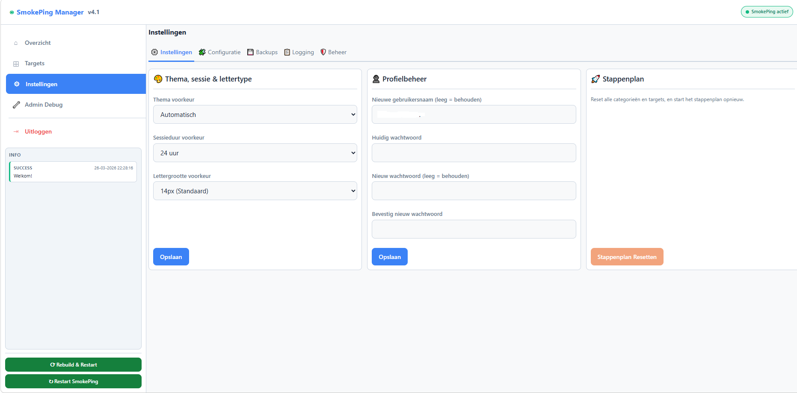
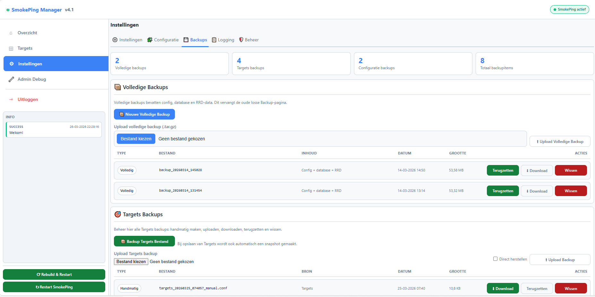
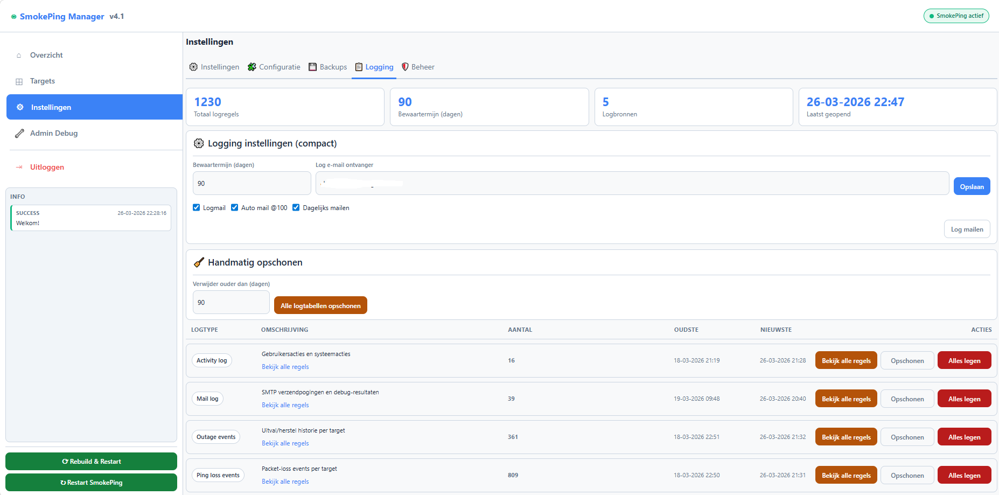
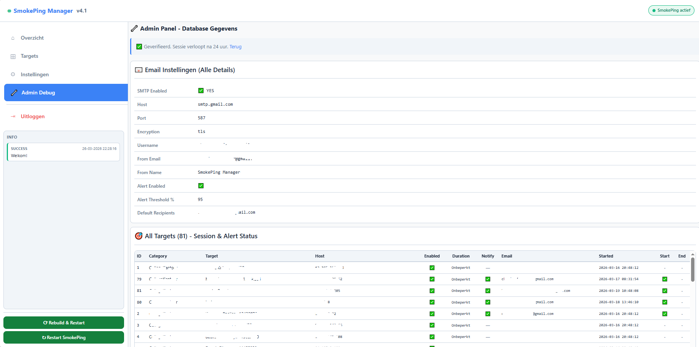

# SmokePing Manager v4.1

## Nederlands

### Overzicht
SmokePing Manager is een complete beheerlaag bovenop SmokePing voor Proxmox/LXC-omgevingen.  
Deze repository bevat een all-in-one installatiescript dat:

- SmokePing Manager installeert en configureert
- de webinterface uitrolt
- onderhoudsacties en beheerfuncties aanbiedt via een CLI-menu
- een snelle start mogelijk maakt via het commando `smokepingmanager`

### Belangrijkste mogelijkheden

#### Installatie en onderhoud (CLI-menu)
Volgende opties zijn direct beschikbaar in het installatiemenu:

1. Volledige installatie
2. Script updaten en direct opnieuw starten
3. Clean uninstall
4. Targets herstellen (basisconfig leeg)
5. RRD-bestanden wissen (grafiekdata)
6. Alle targets wissen (database + bestand)
7. Targets-bestand downloaden
8. Backup maken
9. Backup terugzetten
10. Gebruikersnaam/wachtwoord wijzigen
11. Gebruikersbeheer CLI
12. SmokePing restart
13. SmokePing reload
14. SmokePing status
15. `smokeping --check`

#### Webapp functies
- Dashboard/Overzicht met live statistieken
- Targetsbeheer:
  - categorieen en targets
  - IPv4 en IPv6
  - probe-selectie
  - sorting/reordering
- Sessiebeheer per target:
  - sessieduur
  - sessie-start/einde notificaties
  - handmatig sessie beeindigen
- Uitvalregistratie en notificaties:
  - outage tracking
  - batch/interval notificaties
  - pingverlies meldingen
- E-mailconfiguratie:
  - SMTP instellingen
  - testmail
  - mail-logboek
- Backups:
  - volledige backups
  - targets backups
  - configuratie backups
  - upload en restore
- Configuratie-editor voor SmokePing-bestanden
- Logging-tab met diverse logweergaves
- Beheer-tab met extra adminfuncties
- Admin Debug-pagina met:
  - uitgebreide email settings inspectie
  - all targets overzicht
  - mail log overzicht
- Gebruikersrollen:
  - admin
  - manager
  - readonly
- UI-instellingen:
  - thema (auto/licht/donker)
  - lettergrootte
  - websessieduur (1, 6, 12, 24 uur)
- Responsieve mobiele weergave

### Technische highlights
- SQLite database
- Veilige login met gehashte wachtwoorden (bcrypt)
- CSRF-bescherming op formulieren
- Activiteitenlog
- Integratie met systemd (`restart`, `reload`, `status`)
- Cronjob voor notificatiescript

### Vereisten
- Debian/Ubuntu-achtige Linux omgeving (bij voorkeur LXC)
- Root toegang
- Netwerktoegang voor package installatie en updates

### Snelle start

```bash
wget -O install_smokeping_manager.sh https://charlesderidder.nl/proxmox/install_smokeping_manager.sh
chmod +x install_smokeping_manager.sh
./install_smokeping_manager.sh
```

Na installatie/updaten kun je het script altijd starten met:

```bash
smokepingmanager
```

### Webtoegang
Standaard URL na installatie:

- `http://<server-ip>/smokeping-manager/`

Standaard login:

- Gebruiker: `admin`
- Wachtwoord: `admin`

Wijzig het wachtwoord direct na eerste login.

### Screenshots
Onderstaande afbeeldingen tonen de belangrijkste onderdelen van de applicatie.








---

## English

### Overview
SmokePing Manager is a full management layer on top of SmokePing for Proxmox/LXC environments.  
This repository contains an all-in-one installer script that:

- installs and configures SmokePing Manager
- deploys the web application
- provides maintenance and management actions through a CLI menu
- enables fast launch using the `smokepingmanager` command

### Key features

#### Installation and maintenance (CLI menu)
The following options are available directly from the installer menu:

1. Full installation
2. Update script and restart immediately
3. Clean uninstall
4. Restore targets (empty base config)
5. Clear RRD files (graph data)
6. Wipe all targets (database + file)
7. Download targets file
8. Create backup
9. Restore backup
10. Change username/password
11. CLI user management
12. Restart SmokePing
13. Reload SmokePing
14. SmokePing status
15. `smokeping --check`

#### Web application features
- Dashboard with live metrics
- Target management:
  - categories and targets
  - IPv4 and IPv6
  - probe selection
  - sorting/reordering
- Per-target session management:
  - session duration
  - session start/end notifications
  - manual session end
- Outage tracking and notifications:
  - outage state tracking
  - batch/interval notifications
  - packet-loss notifications
- Email configuration:
  - SMTP settings
  - test email
  - mail log
- Backups:
  - full backups
  - targets backups
  - configuration backups
  - upload and restore
- SmokePing config file editor
- Logging tab with multiple log views
- Management tab with additional admin features
- Admin Debug page including:
  - detailed email settings view
  - all targets overview
  - mail log overview
- User roles:
  - admin
  - manager
  - readonly
- UI settings:
  - theme (auto/light/dark)
  - font size
  - web session timeout (1, 6, 12, 24 hours)
- Responsive mobile UI

### Technical highlights
- SQLite database
- Secure login with bcrypt password hashing
- CSRF protection on forms
- Activity logging
- systemd integration (`restart`, `reload`, `status`)
- Cron-based notification processing

### Requirements
- Debian/Ubuntu-like Linux environment (LXC recommended)
- Root privileges
- Network access for package install and updates

### Quick start

```bash
wget -O install_smokeping_manager.sh https://charlesderidder.nl/proxmox/install_smokeping_manager.sh
chmod +x install_smokeping_manager.sh
./install_smokeping_manager.sh
```

After installation/update, start anytime with:

```bash
smokepingmanager
```

### Web access
Default URL after installation:

- `http://<server-ip>/smokeping-manager/`

Default credentials:

- Username: `admin`
- Password: `admin`

Change the password immediately after first login.
